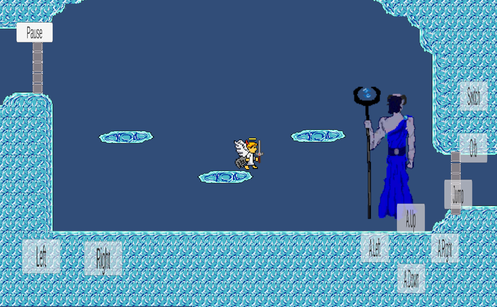
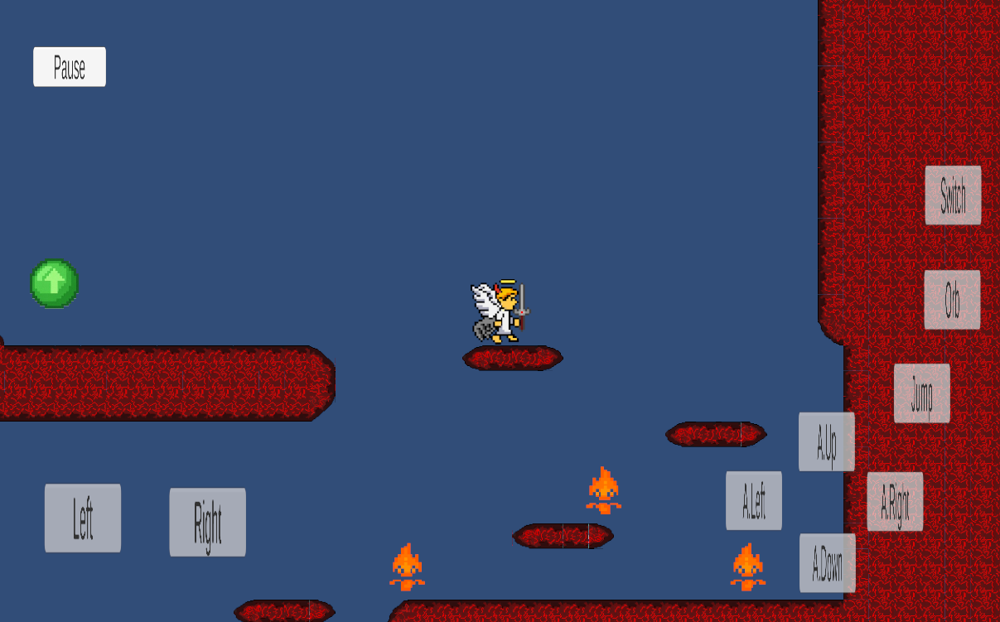
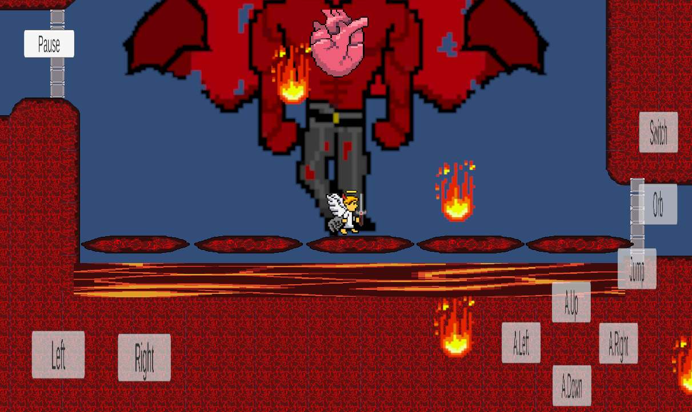

# Store Assets Checklist

## Icon

The icon will be thought to be an angel enveloped in flames.It will be 512*512, main colors red, dark red for the flames and white for the angel. 

## Features

## Hell Frontiers

## Main Art

The game features a pixel-art style and predominantly uses a dark color palette to evoke an underworld atmosphere.

Specific colors are used depending on the boss's zone—for instance, red for wrath and blue for sadness—but these are always combined with black.

## Slogan

To return to Heaven, the angel must reclaim their power—meaning they must defeat the bosses and gradually recover their lost emotions.

## Phone Images

.jpg>)

.jpg>)

.jpg>)

All images are on the screenshotfolder.

## Game Images

All images are on the screenshotfolder.

## Asset state

I think I have the main art of this part, player, enemies, boss and more importantly map. I dont have the doors final art yet nor the animations nor anything for the future weeks. 

